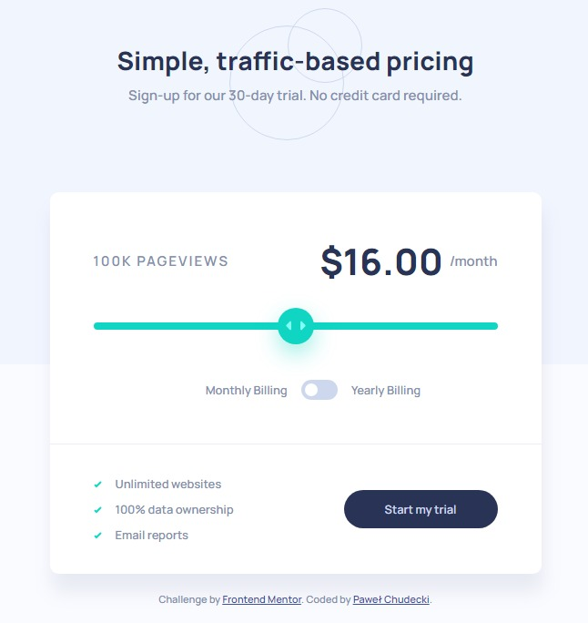

# Frontend Mentor - Interactive pricing component solution

This is a solution to the [Interactive pricing component challenge on Frontend Mentor](https://www.frontendmentor.io/challenges/interactive-pricing-component-t0m8PIyY8). Frontend Mentor challenges help you improve your coding skills by building realistic projects.

## Table of contents

- [The challenge](#the-challenge)
- [Screenshot](#screenshot)
- [Links](#links)
- [Built with](#built-with)
- [What I learned](#what-i-learned)
- [Author](#author)

### The challenge

Users should be able to:

- View the optimal layout for the app depending on their device's screen size
- See hover states for all interactive elements on the page
- Use the slider and toggle to see prices for different page view numbers

### Screenshot

### Links

- Solution URL: [https://www.frontendmentor.io/solutions/interactive-pricing-component-RWGZHZatTk](https://www.frontendmentor.io/solutions/interactive-pricing-component-RWGZHZatTk)
- Live Site URL: [https://soulrvr29.github.io/interactive-pricing-component/](https://soulrvr29.github.io/interactive-pricing-component/)

### Built with

- Semantic HTML5 markup
- Flexbox
- CSS Grid

- Visual Studio Code

### What I learned

That was good practice to lern flexbox, grid, and especially javascript when I was doing interaction
with slider and price changing.

## Author

- Frontend Mentor - [@SoulRvr29](https://www.frontendmentor.io/profile/SoulRvr29)
